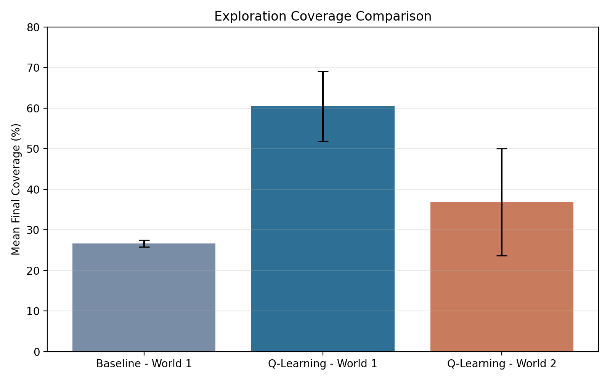
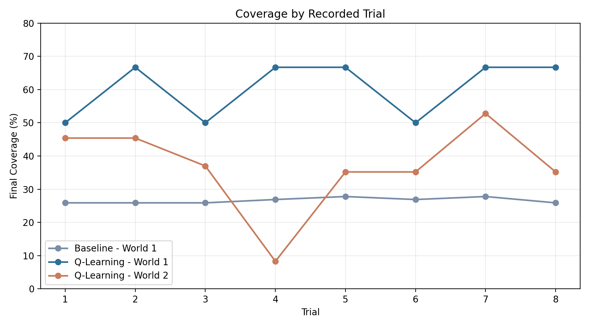

# Autonomous Robot Exploration with Q-Learning

A three-person University of Birmingham robotics project evaluating autonomous exploration in Webots using a trained Q-learning policy, LiDAR-based safety, and repeated simulation experiments.

This repository is a curated portfolio copy focused on my verified Webots controller, experiment, parameter-tuning, logging, and evaluation contributions. It is not a full standalone reproduction of the original team project.

## Key Result

Across eight recorded 300-second World 1 trials calculated from the repository CSV logs:

- Baseline mean exploration coverage: 26.6%
- Q-learning mean exploration coverage: 60.4%

On the more cluttered World 2:

- Q-learning mean exploration coverage: 36.8%

The learned controller improved exploration coverage on the environment it was developed for, but performance dropped when transferred to a more cluttered environment. That makes the generalisation limit visible in the recorded trials rather than only in the written report.

## My Contributions

- Developed the baseline Webots experiment controller
- Developed the Webots controller used to deploy and evaluate trained Q-tables
- Tuned movement and LiDAR-based safety parameters
- Worked on World 1 and World 2 simulation setup and testing
- Ran repeated 300-second experiments and logged coverage/collision data
- Analysed controller behaviour across World 1 and World 2

## Technology

- Python
- Webots
- Reinforcement Learning / Tabular Q-Learning
- LiDAR
- CSV-based experiment logging
- Simulation testing

Tabular Q-learning was part of the project stack, but this curated copy does not present the full RL training implementation as my sole authorship.

## System Overview

`offline trained Q-table -> Webots deployment controller -> GPS + compass state -> Q-table action -> LiDAR safety handling -> motor command -> coverage/collision logging`

Portfolio scope: the controller source is included as evidence of my verified implementation and evaluation work. The full team mapping / A* support and trained Q-table used by the original project are intentionally not reproduced here, so this curated repository is not a standalone runnable build.

## Experimental Setup

- World 1: primary evaluation environment
- World 2: more cluttered transfer/generalisation environment
- Eight recorded trials per condition
- 300 seconds per trial
- Main metrics: exploration coverage and collision count

## Results

| Condition | Mean Coverage |
| --- | ---: |
| Baseline - World 1 | 26.6% |
| Q-Learning - World 1 | 60.4% |
| Q-Learning - World 2 | 36.8% |

The World 1 comparison shows a clear improvement in exploration coverage for the learned controller. The World 2 results show weaker transfer, which is consistent with a tabular policy tuned around a specific environment layout.

Raw trial logs are included for reproducibility; the summary table and figures provide the quickest view of the results.

## Repository Structure

- `src/controllers/`: curated controller code with verified contribution evidence
- `worlds/`: the two Webots environments used for testing
- `results/raw/`: copied evaluation logs for all 24 recorded trials
- `results/summary/`: reproducible aggregate metrics from the copied logs
- `results/figures/`: figures generated directly from the copied logs
- `docs/PROJECT_CONTEXT.md`: team context and attribution boundaries

## Team Attribution

This was a three-person university team project. This curated portfolio focuses on my verified contributions in Webots experimentation, controller development, parameter tuning, simulation testing, and evaluation. It does not claim sole ownership of the full team RL or mapping system.

## Limitations

- The Q-table used in deployment does not generalise strongly from World 1 to World 2
- The work was carried out in simulation rather than on a physical robot
- Full team RL training and mapping source is intentionally not reproduced in this curated portfolio

## Notes

- The world files reference Webots `EXTERNPROTO` and remote simulation assets, so Webots may need internet access to load them in a fresh environment.
- Summary metrics in `results/summary/experiment_summary.csv` were calculated directly from the copied raw CSV logs in this repository.
